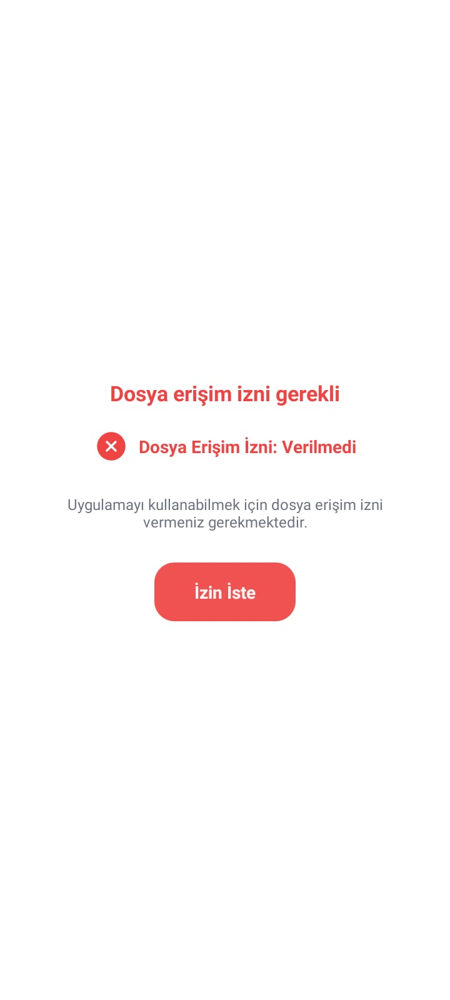
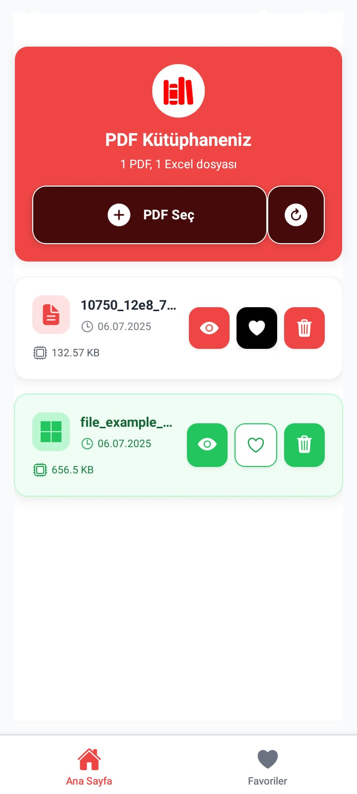
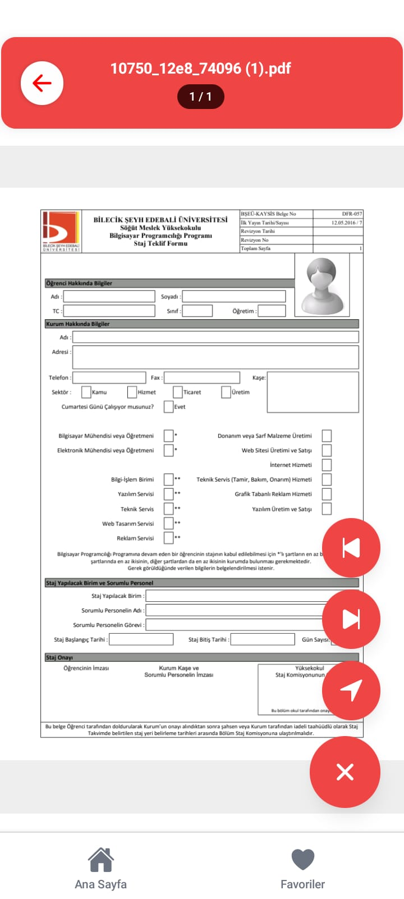
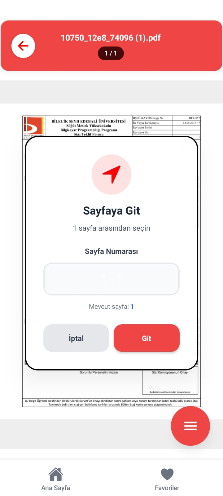
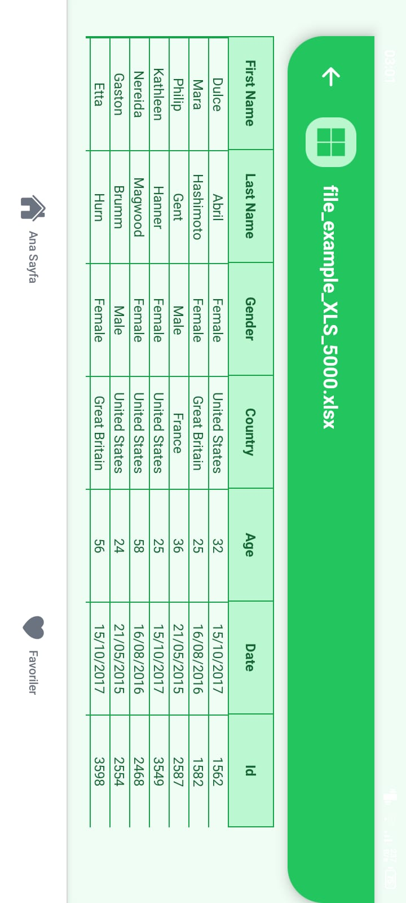
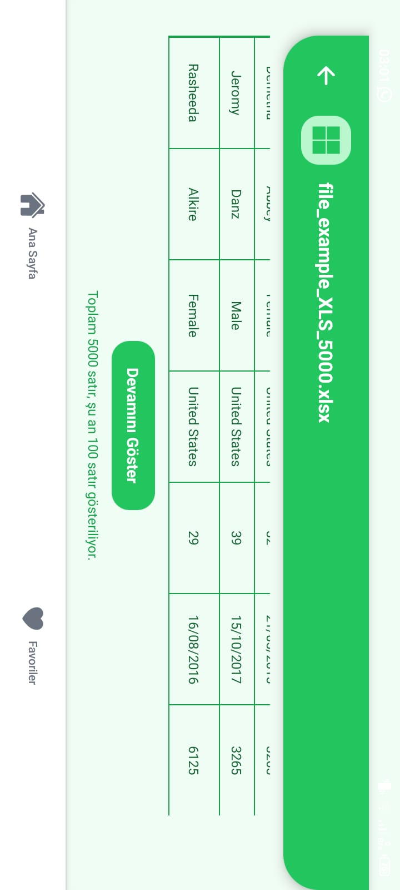

# 📱 GViewer - PDF & Excel Viewer

Modern ve kullanıcı dostu bir PDF ve Excel dosya görüntüleyici uygulaması. React Native ve Expo ile geliştirilmiştir.



## ✨ Özellikler

- 📄 **PDF Görüntüleme**: PDF dosyalarını tam ekran görüntüleme
- 📊 **Excel Görüntüleme**: Excel dosyalarını tablo formatında görüntüleme
- ⭐ **Favoriler**: Sık kullanılan dosyaları favorilere ekleme
- 📁 **Dosya Yönetimi**: Cihazdan dosya seçme ve yönetme
- 🎨 **Modern UI**: NativeWind ile tasarlanmış modern arayüz
- 🌙 **Dark/Light Mode**: Otomatik tema desteği
- 📱 **Cross-Platform**: Android ve iOS desteği

## 🚀 Kurulum

### Gereksinimler

- Node.js (v18 veya üzeri)
- npm veya yarn
- Expo CLI
- Android Studio (Android geliştirme için)
- Xcode (iOS geliştirme için, sadece macOS)

### Adımlar

1. **Projeyi klonlayın**
   ```bash
   git clone https://github.com/your-username/gviewer.git
   cd gviewer
   ```

2. **Bağımlılıkları yükleyin**
   ```bash
   npm install
   ```

3. **Uygulamayı başlatın**
   ```bash
   npx expo start
   ```

4. **Platform seçenekleri:**
   - Android: `npx expo run:android`
   - iOS: `npx expo run:ios`
   - Web: `npx expo start --web`

## 📸 Ekran Görüntüleri

<div style="display: flex; flex-wrap: wrap; gap: 10px;">
  
  
  
  
  
  
</div>

## 🛠️ Teknolojiler

- **React Native** - Cross-platform mobil geliştirme
- **Expo** - Geliştirme platformu ve araçları
- **TypeScript** - Tip güvenliği
- **NativeWind** - Tailwind CSS for React Native
- **React Navigation** - Navigasyon
- **Expo Router** - File-based routing
- **React Native PDF** - PDF görüntüleme
- **XLSX** - Excel dosya işleme

## 📁 Proje Yapısı

```
gviewer/
├── app/                    # Expo Router sayfaları
│   ├── index.tsx          # Ana sayfa
│   ├── pdf-viewer.tsx     # PDF görüntüleyici
│   ├── excel-viewer.tsx   # Excel görüntüleyici
│   └── favorites.tsx      # Favoriler sayfası
├── components/            # Yeniden kullanılabilir bileşenler
│   ├── PDFList.tsx        # PDF dosya listesi
│   ├── FavoritePDFList.tsx # Favori PDF'ler
│   └── PermissionGate.tsx # İzin kontrolü
├── assets/               # Statik dosyalar
│   ├── images/          # Görseller
│   └── fonts/           # Fontlar
└── types/               # TypeScript tip tanımları
```

## 🔧 Geliştirme

### Scripts

```bash
# Geliştirme sunucusunu başlat
npm start

# Android build
npm run android

# iOS build
npm run ios

# Web build
npm run web

# Linting
npm run lint
```

### Build

Release APK oluşturmak için:

```bash
cd android
./gradlew assembleRelease
```

APK dosyası `android/app/build/outputs/apk/release/` klasöründe oluşturulacaktır.

## 🤝 Katkıda Bulunma

1. Bu repository'yi fork edin
2. Feature branch oluşturun (`git checkout -b feature/amazing-feature`)
3. Değişikliklerinizi commit edin (`git commit -m 'Add amazing feature'`)
4. Branch'inizi push edin (`git push origin feature/amazing-feature`)
5. Pull Request oluşturun

## 📄 Lisans

Bu proje MIT lisansı altında lisanslanmıştır. Detaylar için [LICENSE](LICENSE) dosyasına bakın.

## 👨‍💻 Geliştirici

**Gürkay** - [GitHub](https://github.com/your-username)

## 🙏 Teşekkürler

- [Expo](https://expo.dev) - Harika geliştirme platformu
- [React Native](https://reactnative.dev) - Cross-platform mobil geliştirme
- [NativeWind](https://www.nativewind.dev) - Tailwind CSS for React Native

---

⭐ Bu projeyi beğendiyseniz yıldız vermeyi unutmayın!
